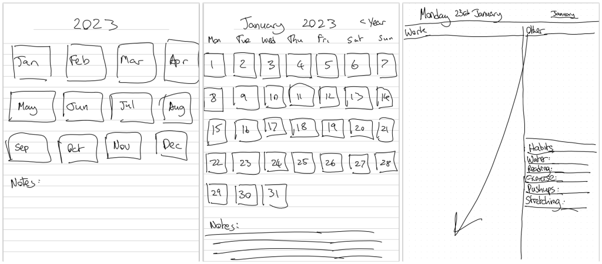
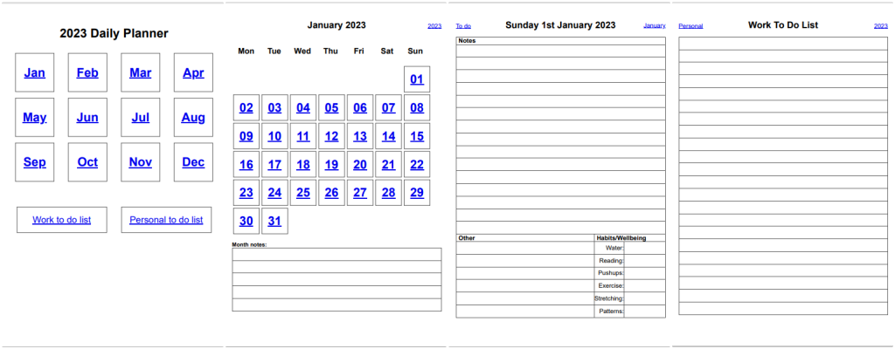
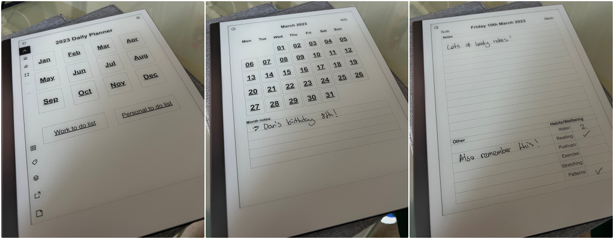

# Creating Remarkable Templates (HTML to PDF)
C#/.NET code to create a yearly planner template PDF for your Remarkable device.

## Walkthrough video
To view a video explaining the solution, see here: 

[https://www.youtube.com/watch?v=qYMb_yIzIJs](https://www.youtube.com/watch?v=qYMb_yIzIJs)

## Solution structure
There are two projects in the Solution
- HtmlToPdf.WebApplication
- HtmlToPdf.ConsoleApplication

Note: The PDF generation is done using [Syncfusions HTML to PDF generation library](https://help.syncfusion.com/file-formats/pdf/converting-html-to-pdf). If you do not have a license key, you will need to obtain one or use another HTML to PDF library.

Another note: The code has not been optimised or especially tidied - for example there are inline styles that can be moved to css classes and refactoring into partial views that *could* be done. The code shared is merely a quick working proof of concept and should be thought of as such.

## Running the code
1. Run the web application locally, taking note of the url it runs on (https://blah)

Note: When you run the web application locally, the layout may look odd i.e. large text, no margins between some items where there are invisible page breaks (don't worry - it looks fine when the PDF is generated)

2. Update the url in the console application, run it and it will create the PDF at the output location

Note: You will need to update the console application `Credentials.cs` with your own Syncfusion LicenseKey OR replace this code with a different HTML to PDF library.

## Want a preview without a licence?
You can still create the PDF without a Syncfusion license key, but it will include "Syncfusion Trial" wording, see the output 
[templates/2023-Yearly-Planner-v7-no-key.pdf](templates/2023-Yearly-Planner-v7-no-key.pdf) file for example.

To do this, in `src\HtmlToPdf.ConsoleApplication\Program.cs`

Comment out the following lines

`  
if (string.IsNullOrEmpty(Credentials.SyncfusionLicenseKey))
    throw new Exception("You need to provide your own Syncfusion license key or find another tool that will generate a PDF from HTML");
    `

and 

`Syncfusion.Licensing.SyncfusionLicenseProvider.RegisterLicense(Credentials.SyncfusionLicenseKey);`
    

## How I designed my ideal yearly planner template
First I designed my ideal layout

Then I coded it up in HTML, which when converted to PDF looked like this (links working and all!)

Then when uploaded to my Remarkable device I can navigate to any day/page and jot notes all over it.

## I just want the template PDF file
That's fine, if you're happy with the PDF planner layout i've created, you can get your own copy of the file at [templates/2023-Yearly-Planner-v9.pdf](templates/2023-Yearly-Planner-v9.pdf)

## Update 31st July 2023
The template has been updated to include day links and weekly summary pages.

## Keep updated!
To see similar projects like this, follow me on:

- [Twitter](https://twitter.com/LeeEnglestone)
- [LinkedIn](https://www.linkedin.com/in/LeeEnglestone/)
- [YouTube](https://www.youtube.com/@LeeEnglestone/videos)

I'd be especially interested to hear if you manage to find and implement a free HTML to PDF library that produces the same output PDF as Syncfusions from the web application (i've tried a couple with no success).
